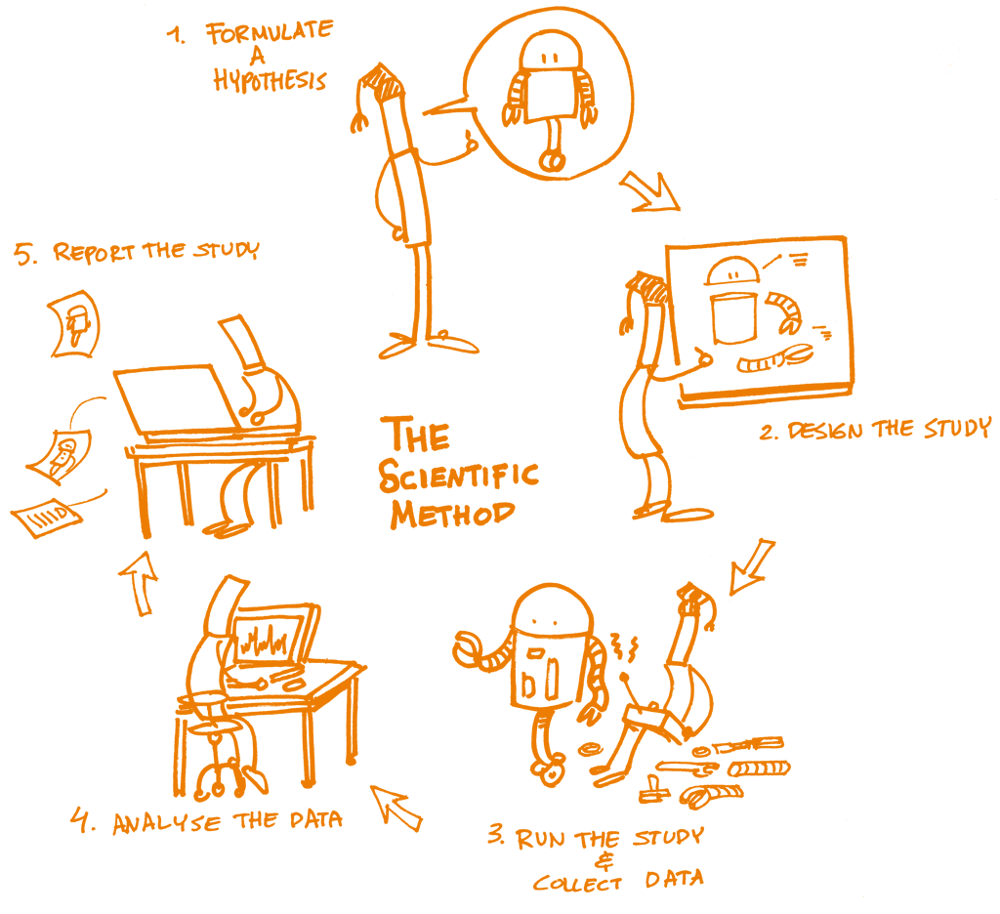
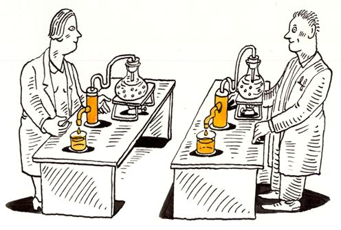

```{r setup, include=FALSE}
options(htmltools.dir.version = FALSE)
knitr::opts_chunk$set(
  fig.width=9, fig.height=3.5, fig.retina=3,
  out.width = "100%",
  cache = FALSE,
  echo = TRUE,
  message = FALSE, 
  warning = FALSE,
  hiline = TRUE
)

if (!require(remotes)) install.packages("remotes")
if (!require(fontawesome)) remotes::install_github("rstudio/fontawesome")
```

```{r xaringan-themer, include=FALSE, warning=FALSE}
library(xaringanthemer)
style_mono_light(
  base_color = "#002147",
  title_slide_background_image = "",
  title_slide_background_size = "cover",
  header_font_google = google_font("Fira Sans"),
  text_font_google   = google_font("Fira Sans Condensed"),
  text_font_size = "1.2em",
  link_color = "#214700",
  header_h1_font_size = "50px",
  header_h2_font_size = "40px",
  header_h3_font_size = "30px",
  code_font_google   = google_font("Fira Mono"),
  text_slide_number_font_size = "0.5em",
  footnote_font_size = "0.5em"
)
```

# Outline

1. What is Open Science?

2. What is Reproducible Research?

3. Why Reproducible Research?

4. How to do Reproducible Research?

---

background-color: #FFFFFF

# What is Open Science?

.pull-left[
.center[]
  
.footnote[based on UNESCO concept 2021]
]

.pull-right[
* movement to make scientific research and dissemination accessible to anyone

* aims for greater transparency in research and remove barriers for sharing outputs, resources, methods or tools at any stage of the research process
]

---

background-color: #FFFFFF

# What is Reproducible Research?

.pull-left[
.center[]

.footnote[from the [Open Science Training Handbook](https://open-science-training-handbook.github.io/Open-Science-Training-Handbook_EN//02OpenScienceBasics/04ReproducibleResearchAndDataAnalysis.html)]
]

.pull-right[
* The concept of reproducibility is directly linked to the scientific method
  1. Formulating a hypothesis

  2. Designing the study

  3. Running the study and collecting the data

  4. Analyzing the data

  5. Reporting the study

* Each of these steps should be clearly reported by providing clear and open documentation, and thus making the study transparent and reproducible.
]

---

background-color: #FFFFFF

# What is Reproducible Research?

.pull-left[
* Research papers with accompanying software tools that allow the reader to directly reproduce the results and
employ the methods that are presented in the research paper ([Gentleman and Lang, 2004](https://citeseerx.ist.psu.edu/viewdoc/download?doi=10.1.1.684.9629&rep=rep1&type=pdf))

* Research data and code are made available so that others are able to reach the same results as are claimed in scientific outputs ([Open Science Training Handbook](https://open-science-training-handbook.github.io/Open-Science-Training-Handbook_EN//02OpenScienceBasics/04ReproducibleResearchAndDataAnalysis.html))

* The standard of reproducibility calls for the data and the computer code used to analyze the data be made available to others ([Peng, 2012](https://www.ncbi.nlm.nih.gov/pmc/articles/PMC3383002/pdf/nihms382015.pdf))
]

.pull-right[
.center[]

.footnote[from https://www.displayr.com/what-is-reproducible-research]
]

---

background-color: #FFFFFF
background-image: url(images/reproducible_research3.jpg)
background-size: 55%

# Differentiating Reproducible Research

.footnote[This image was created by [Scriberia](https://www.scriberia.com/) for [The Turing Way](https://the-turing-way.netlify.app/welcome) community and is used under a CC-BY licence.]

---

background-color: #FFFFFF
background-image: url(images/nature_repro_research.jpg)
background-size: 65%

# Why Reproducible Research?

.footnote[Baker, M. 1,500 scientists lift the lid on reproducibility. Nature 533, 452–454 (2016). https://doi.org/10.1038/533452a]

---

background-color: #FFFFFF
background-image: url(images/why_repro_research1.gif)
background-size: 90%

# Factors in irreproducible research

---

# Factors in irreproducible research

* Not enough documentation on how experiment is conducted and data is generated

* Data used to generate original results unavailable

* Software used to generate original results unavailable

* Difficult to recreate software environment (libraries, versions) used to generate original results

* Difficult to rerun the computational steps

---

background-color: #FFFFFF

# How to do Reproducible Research?

.pull-left[
### The reproducibility spectrum
.center[]
]

.pull-right[
### Steps in reproducible research

* Record the project’s provenance

* Data and metadata curation

* Establish a testing/analysis workflow

* Test, document, and publish your code

* Share
]

---

# Why R for Reproducible Research?

.pull-left[
* freely available

* huge user and developer community

* has a robust set of user- and community-developed packages that support reproducible research 
]

.pull-right[
.center[]
]

---

class: inverse, center, middle

# Questions?

---

class: inverse, center, middle

# Thank you!

Slides can be viewed at https://OxfordIHTM.github.io/open-reproducible-science/session1.html

PDF version of slides can be downloaded at https://OxfordIHTM.github.io/open-reproducible-science/pdf/session1-open-reproducibile-science.pdf

R scripts for slides available at https://github.com/OxfordIHTM/open-reproducible-science

