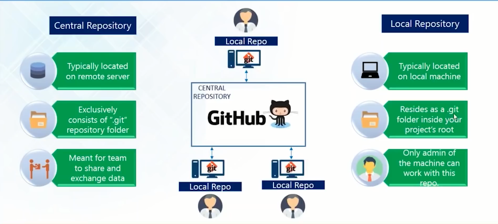

```{r setup, include=FALSE}
options(htmltools.dir.version = FALSE)
knitr::opts_chunk$set(
  fig.width=9, fig.height=3.5, fig.retina=3,
  out.width = "100%",
  cache = FALSE,
  echo = TRUE,
  message = FALSE, 
  warning = FALSE,
  hiline = TRUE
)

if (!require(remotes)) install.packages("remotes")
if (!require(fontawesome)) remotes::install_github("rstudio/fontawesome")
```

```{r xaringan-themer, include=FALSE, warning=FALSE}
library(xaringanthemer)
style_mono_light(
  base_color = "#002147",
  title_slide_background_image = "",
  title_slide_background_size = "cover",
  header_font_google = google_font("Fira Sans"),
  text_font_google   = google_font("Fira Sans Condensed"),
  text_font_size = "1.2em",
  link_color = "#214700",
  header_h1_font_size = "50px",
  header_h2_font_size = "40px",
  header_h3_font_size = "30px",
  code_font_google   = google_font("Fira Mono"),
  text_slide_number_font_size = "0.5em",
  footnote_font_size = "0.5em"
)
```

# Outline

1. What is Git? Why use Git?

2. What is GitHub? Why use GitHub?

3. Git and GitHub

3. Git integration with RStudio

4. Practial session

---

# What is git?

.pull-left[
* Free and open source distributed **version control system**

* Built for software development for a group of developers to work collaboratively and to manage the evolution of a set of files

    - like *"Track Changes"* in Microsoft Word on steriods!

* Has been re-purposed to manage a collection of files that make up a typical data analytical project that consists of data, figures, reports, and source code
]

.pull-right[
[.center[]](https://git-scm.com)
]

---

# Why use Git?

.pull-left[
.center[]
]

.pull-right[
### Version control

* Is the only reasonable and sane way to keep track changes in source code, manuscripts, presentations, and data analysis projects

* Documentation of differences between versions

* Exploration of differences between versions
]

---

# Why use Git?

.pull-left[
.center[]
]

.pull-right[
### Communication and collaboration

* **Communicating** one's research project with other people is part of the scientific process - not just results but the whole process

* **Collaborating** with others on each other's research project allows us to build on each other's past work, using them for a different context/problem, or re-purposing them to come up with a new approach/solution

* Communication and collaboration on various aspects of the scientific process is faciliated by using Git 
]

---

# What is GitHub?

.pull-left[
[.center[]](https://github.com)
]

.pull-right[

<!---
.center[]
--->

* Service provider of hosting for software development and version control using Git

* Offers distributed version control and source code management functionality of Git, plus its own features such as bug tracking, feature request, task management, continuous integration and wikis for every project

* Like *facebook* but for programmers

* Facilitates *"openness"* of **Open Source**

* Lowers the barriers to collaboration
]

---

background-color: #FFFFFF

# Git and GitHub

.center[]

---

background-color: #FFFFFF
background-image: url(images/pcbi.1004947.g001.jpg)
background-size: 50%

# Git and GitHub

.footnote[Taken from Perez-Riverol, Y., Gatto, L., Wang, R., Sachsenberg, T., Uszkoreit, J., Leprevost, F., Fufezan, C., Ternent, T., Eglen, S. J., Katz, D. S., Pollard, T. J., Konovalov, A., Flight, R. M., Blin, K., & Vizcaíno, J. A. (2016). Ten Simple Rules for Taking Advantage of Git and GitHub. PLoS computational biology, 12(7), e1004947. https://doi.org/10.1371/journal.pcbi.1004947]

---

# Git integration with RStudio

.pull-left[
* [RStudio](https://www.rstudio.com/products/rstudio/) is a popular integrated development environment (IDE) for [R](https://cran.r-project.org)

* [RStudio](https://www.rstudio.com/products/rstudio/) has built-in facilities for [git](https://git-scm.com/) and [GitHub](https://github.com)

* Within [RStudio](https://www.rstudio.com/products/rstudio/), one can create an [RStudio](https://www.rstudio.com/products/rstudio/) project (a directory with some special files to describe specific [RStudio](https://www.rstudio.com/products/rstudio/) options) which becomes your git repository

* One can easily turn a current git repository into an [RStudio](https://www.rstudio.com/products/rstudio/) project.
]

.pull-left[
.center[]
]

---

class: inverse, center, middle

# Questions?

---

# Practical session

* [Register a GitHub account](https://happygitwithr.com/github-acct.html)

* [Install or upgrade R and RStudio](https://happygitwithr.com/install-r-rstudio.html)

* [Install git](https://happygitwithr.com/install-git.html)

* [Introduce yourself to Git](https://happygitwithr.com/hello-git.html)

* [Personal access token for HTTPS](https://happygitwithr.com/https-pat.html)

* Connect RStudio to git and GitHub - see assignment in GitHub Classroom

---

class: inverse, center, middle

# Thank you!

Slides can be viewed at https://OxfordIHTM.github.io/open-reproducible-science/session2.html

PDF version of slides can be downloaded at https://OxfordIHTM.github.io/open-reproducible-science/pdf/session2-git-and-github-with-r.pdf

R scripts for slides available at https://github.com/OxfordIHTM/open-reproducible-science/session2.Rmd
