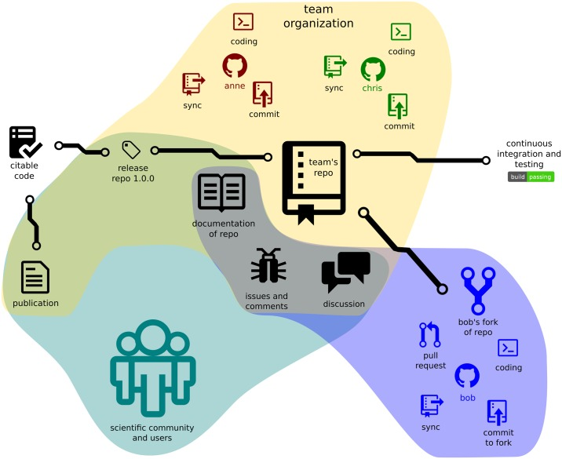

```{r setup, include=FALSE}
options(htmltools.dir.version = FALSE)
knitr::opts_chunk$set(
  fig.width=9, fig.height=3.5, fig.retina=3,
  out.width = "100%",
  cache = FALSE,
  echo = TRUE,
  message = FALSE, 
  warning = FALSE,
  hiline = TRUE
)

if (!require(remotes)) install.packages("remotes")
if (!require(fontawesome)) remotes::install_github("rstudio/fontawesome")
```

```{r xaringan-themer, include=FALSE, warning=FALSE}
library(xaringanthemer)
style_mono_light(
  base_color = "#002147",
  title_slide_background_image = "",
  title_slide_background_size = "cover",
  header_font_google = google_font("Fira Sans"),
  text_font_google   = google_font("Fira Sans Condensed"),
  text_font_size = "1.2em",
  link_color = "#214700",
  header_h1_font_size = "50px",
  header_h2_font_size = "40px",
  header_h3_font_size = "30px",
  code_font_google   = google_font("Fira Mono"),
  text_slide_number_font_size = "0.5em",
  footnote_font_size = "0.5em"
)
```

# Outline

* All about environments

* System dependencies management

* Project-local R dependencies management

---

background-color: #FFFFFF

# All about environments

.pull-left[
.center[]
]

.pull-right[
## **Portability** of an R workflow will depend on **reproducibility of its related environments**
]

---

class: inverse, middle, center

# No one cares what operating system you run as long as it stays up.

## Bruce Perens

#### created the defintion of Open Source and wrote the first manifesto of Open Source

---

# Different systems, different requirements

<!---


--->

.pull-left[

```{r, echo = FALSE, eval = TRUE, out.width = "33%"}
knitr::include_graphics(path = "images/Windows_logo_-_2021.svg")
knitr::include_graphics(path = "images/Apple_logo_black.svg")
knitr::include_graphics(path = "images/Tux.svg")
```
]

.pull-right[
* each operating system (and each of its versions) may/will require specific dependencies in order to install R

* each operating system (and each of its versions) may/will require specific dependencies in order to install some R packages 
]

---

# System dependencies management

.pull-left[
.center[]
]

.pull-right[
* solutions/approaches will depend on your use case but the most universal step is **documentation**

* **Supervisor-supervisee** or **small research team** settings - establish compatibility guidelines between members and document system requirements for each project;

* **Medium to largish research team** settings
    - use turn-key solutions that standardise R setup using cloud-based or software-as-a-service (SaaS) solutions (e.g., RStudio Cloud); or,
    - setup machines used to be consistent with team's R workflow system requirements through containerisation (e.g., [Docker](https://www.docker.com/))
]
    
---

# Using containers via Docker


.center[]


* **Containers** are standardised units of packaged software that have everything the software needs to run including libraries, system tools, code, and runtime.

* **Containers** can be deployed either onto remote machines or onto a local machine using [Docker](https://www.docker.com)

* [Rocker](https://www.rocker-project.org/) is a community-organised and community-maintained hub of Docker containers that are pre-built and specified with different variants and configurations of R for various operating systems and for various types of R workflows e.g., base, RStudio, spatial analysis, machine learning, etc.

* Containers support portability because we are able to "carry" with us almost any operating system + R configuration that we might need in our R workflows

---

# Project-local R dependencies management

.pull-left[
.center[]
]

.pull-right[
* The more people collaborate on code and R workflows, the higher the chances that R package dependencies will increase

* The more complex the type of R analysis workflow that is being implemented, the higher the chances that R package dependencies will increase

* Management of R dependencies will be critical in ensuring portability

* The `{renv}` package facilitates this R dependencies management
]

---

# The `{renv}` package

.pull-left[
.center[]
]

.pull-right[
* Initialise a new project-local environment with a private R library;

* Work in the project as normal, installing and removing new R packages as they are needed in the project;

* Save the state of the project library to the lockfile;

* Continue working on your project, installing and updating R packages as needed; and,

* Again save the state of your project library if your attempts to update R packages were successful, or restore to a previous state as encoded in the lockfile if you encounter problems updating a package.
]

---

class: inverse, middle, center

# Questions?

---

class: inverse, center, middle

# Thank you!

Slides can be viewed at https://OxfordIHTM.github.io/open-reproducible-science/session5.html

PDF version of slides can be downloaded at https://OxfordIHTM.github.io/open-reproducible-science/pdf/session5-portable-r-projects.pdf

R scripts for slides available [here](https://github.com/OxfordIHTM/open-reproducible-science/blob/main/session5.Rmd)

