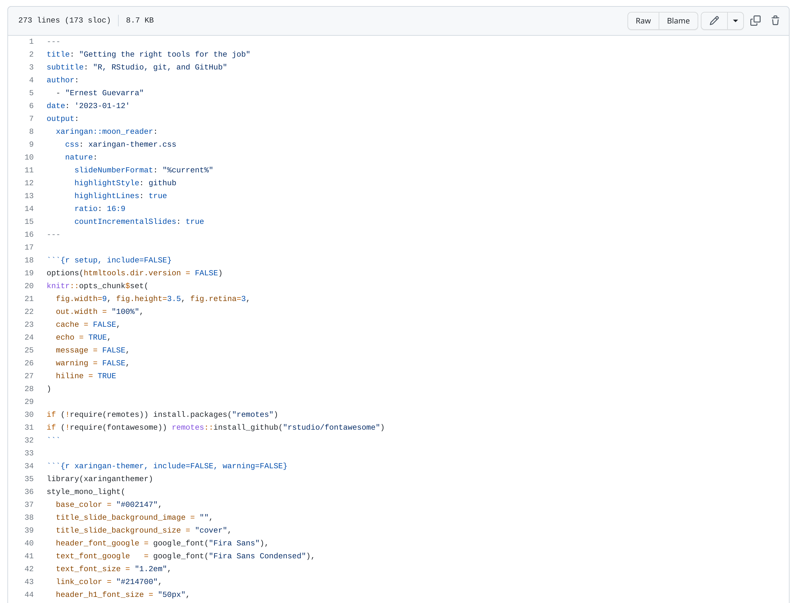

```{r setup, include=FALSE}
options(htmltools.dir.version = FALSE)
knitr::opts_chunk$set(
  fig.width=9, fig.height=3.5, fig.retina=3,
  out.width = "100%",
  cache = FALSE,
  echo = TRUE,
  message = FALSE, 
  warning = FALSE,
  hiline = TRUE
)

if (!require(remotes)) install.packages("remotes")
if (!require(fontawesome)) remotes::install_github("rstudio/fontawesome")
```

```{r xaringan-themer, include=FALSE, warning=FALSE}
library(xaringanthemer)
style_mono_light(
  base_color = "#002147",
  title_slide_background_image = "",
  title_slide_background_size = "cover",
  header_font_google = google_font("Fira Sans"),
  text_font_google   = google_font("Fira Sans Condensed"),
  text_font_size = "1.2em",
  link_color = "#214700",
  header_h1_font_size = "50px",
  header_h2_font_size = "40px",
  header_h3_font_size = "30px",
  code_font_google   = google_font("Fira Mono"),
  text_slide_number_font_size = "0.5em",
  footnote_font_size = "0.5em"
)
```

# Outline

* Project-oriented workflows in R

    * Why organise workflows into projects
    * How to organise workflows into projects

* Literate programming

    * Why use literate programming
    * RMarkdown for literate programming

* Practical session

---

class: inverse, center, middle

# Project-orientd workflows in R

---

# Why organise workflows into projects

* key word is *"organise"*;

* organisation ensures *coherence* and *order* which is helpful to the user whenever he/she goes back to the same work again later;

* organisation supports good documentation; and,

* organisation allows for collaboration.

---

# How to organise workflows into projects

* a unique piece of *"work"* should be its own *project*;

* all resources and tools needed for a *project* should be within the same directory; and,

* group resources and tools within appropriately into their own directories with the project directory.

.pull-left[
.center[]

]

.pull-right[
.center[]
]

---

class: inverse, center, middle

# Literate programming

---

# Why use literate programming

* write code that satisfies both the machine/computer and the human reader/user;

* highlight and give as much importance to the documentation of the processes and the outputs that your code represents;

* focus on communication and understanding of the process and the output; and,

* single document that integrates both code and textual documentation.

---

# R Markdown for literate programming


* R Markdown provides an authoring framework for literate programming;

* A single R Markdown file is used to both save and execute code, and generate high quality reports that can be shared with an audience; and,

* R Markdown documents are fully reproducible and support dozens of static and dynamic output formats.

---

# R Markdown example - PDF report

.pull-left[
.center[]
]

.pull-right[

]

---

# R Markdown example - HTML report

.pull-left[
.center[]
]

.pull-right[
.center[]
]

---

# R Markdown example - Website

.pull-left[
.center[]
]

.pull-right[
.center[]
]

---

# R Markdown example - slide deck

.pull-left[
.center[]
]

.pull-right[
.center[]
]

---

# Basics of R Markdown

* An R Markdown document is written in markdown (an easy-to-write plain text format) and contains chunks of embedded R code, like the document below.

.center[]

---

# Basic Markdown syntax

.pull-left[

### Markdown syntax

* ```*italics*``` or ```_italics_```

* ```**bold**``` or ```__bold__```

* ```> block quote```

* ```# Header 1```

* ```## Header 2```

* ```### Header 3```

* ```#### Header 4```

]


.pull-right[

### Resulting output

* *italics*

* **bold**

* > block quote

* # Header 1

* ## Header 2

* ### Header 3

* #### Header 4

]

---

# Basic Markdown syntax

.pull-left[

### Markdown syntax

* ```[link to Open Reproducible Science website](https://oxford-ihtm.io/open-reproducible-science/)```

* adding an image: ``````

]


.pull-right[

### Resulting output

* [link to Open Reproducible Science website](https://oxford-ihtm.io/open-reproducible-science/)

* adding an image: 

]

---

class: inverse, center, middle

# Questions?

---

class: inverse, center, middle

# Practical session

We'll work through *Exercise 5 - Extending R with packages* in Practical R for Epidemiologists (https://practical-r.org/exercise5.html) as a GitHub Classroom assignment

---

class: inverse, center, middle

# Thank you!

Slides can be viewed at https://oxford-ihtm.io/open-reproducible-science/session5.html

PDF version of slides can be downloaded at https://oxford-ihtm.io/open-reproducible-science/pdf/session5-literate-programming.pdf

R scripts for slides available [here](https://github.com/OxfordIHTM/open-reproducible-science/blob/main/session5.Rmd)

