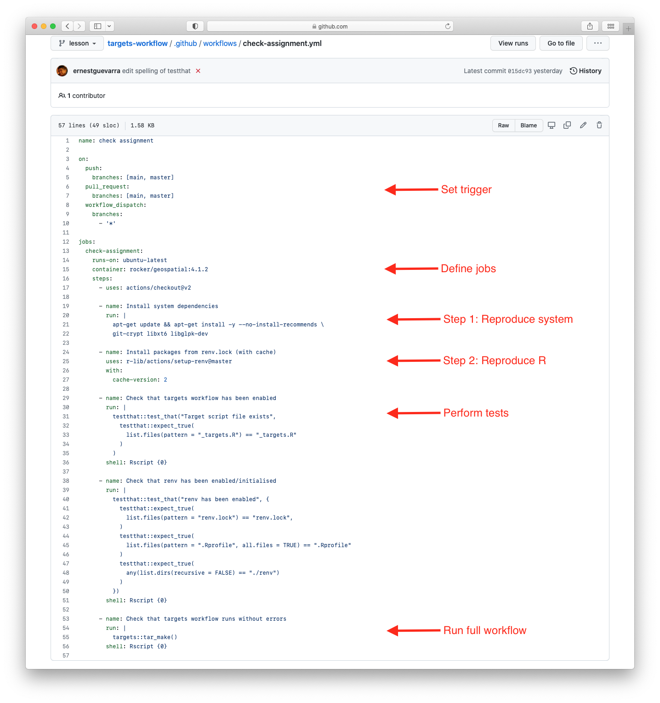

```{r setup, include=FALSE}
options(htmltools.dir.version = FALSE)
knitr::opts_chunk$set(
  fig.width=9, fig.height=3.5, fig.retina=3,
  out.width = "100%",
  cache = FALSE,
  echo = TRUE,
  message = FALSE, 
  warning = FALSE,
  hiline = TRUE
)

if (!require(remotes)) install.packages("remotes")
if (!require(fontawesome)) remotes::install_github("rstudio/fontawesome")
```

```{r xaringan-themer, include=FALSE, warning=FALSE}
library(xaringanthemer)
style_mono_light(
  base_color = "#002147",
  title_slide_background_image = "",
  title_slide_background_size = "cover",
  header_font_google = google_font("Fira Sans"),
  text_font_google   = google_font("Fira Sans Condensed"),
  text_font_size = "1.2em",
  link_color = "#214700",
  header_h1_font_size = "50px",
  header_h2_font_size = "40px",
  header_h3_font_size = "30px",
  code_font_google   = google_font("Fira Mono"),
  text_slide_number_font_size = "0.5em",
  footnote_font_size = "0.5em"
)
```

# Outline

* Overview of automation

* Introduction to GitHub Actions

* Demonstration of automation

---

background-color: #FFFFFF

# Automation

.center[]

### 'Automating' comes from the roots 'auto-' meaning 'self-', and 'mating', meaning 'screwing'

???

---

# What can be automated?

* works best with a **project workflow** (sometimes called a **project pipeline**)

    - our recommended solution for this is the `{targets}` workflow/pipeline

* works best if project workflow is **portable**

    - our recommended solution for this is `{renv}`

---

# Why automate?

* to reproduce previous results

* to recreate results deleted by *fat fingers*

* to rerun the workflow/pipeline with updated software

* to run the same workflow/pipeline on a new dataset

---

background-color: #FFFFFF
background-image: url(https://miro.medium.com/max/2617/1*8mUtip6z_oydfLi4P86KUw.png)
background-size: contain

???

* `GitHub Actions` allows **automation**, **customisation**, and **execution** of your research project workflows right in your GitHub repository.

* Composed of a job or a number of jobs. The job/s are then composed of steps that control the order in which actions are run in order to complete a job/s. This workflow is scheduled or triggered by a specific event and runs on what is called a runner - a server that has the GitHub Actions runner application installed - that is either hosted by GitHub, or self-hosted on your own machines.

* This whole workflow including the event trigger and the runner on which the workflow will run in are specified and detailed using a workflow `.yml` file that is saved inside a directory named `.github` within your GitHub repository in which you want to use GitHub Actions on.

---

# Example GitHub Actions automation

.pull-left[
.center[]
]

.pull-right[
* Example automation built-in to the latest assignment on creating targets workflow

* Can be found at `.github/workflows/check-assignment.yml`
]

---

# Setting the `trigger` for the automation

```YAML
name: check assignment

on:
  push:
    branches: [main, master]
  pull_request:
    branches: [main, master]
  workflow_dispatch:
    branches:
      - '*'
```

---

# Defining `jobs` to be implemented in the workflow

```YAML
jobs:
  check-assignment:
    runs-on: ubuntu-latest
    container: rocker/geospatial:4.1.2
    steps:
      - uses: actions/checkout@v2
```
      
---

# Specifying `steps` in the workflow

### Workflow step 1: reproduce the system environment

```YAML
      - name: Install system dependencies
        run: |
          apt-get update && apt-get install -y --no-install-recommends \
          git-crypt libxt6 libglpk-dev
```

### Workflow step 2: Reproduce the R project-local environment

```YAML
      - name: Install packages from renv.lock (with cache)
        uses: r-lib/actions/setup-renv@master
        with:
          cache-version: 2
```

---
   
# Specifying `steps` in the workflow

### Workflow step 3: Perform tests/checks

```YAML
      - name: Check that targets workflow has been enabled
        run: |
          testthat::test_that("Target script file exists",
            testthat::expect_true(
              list.files(pattern = "_targets.R") == "_targets.R"
            )
          )
        shell: Rscript {0}
      
      - name: Check that renv has been enabled/initialised
        run: |
          testthat::test_that("renv has been enabled", {
            testthat::expect_true(
              list.files(pattern = "renv.lock") == "renv.lock",
            )
            testthat::expect_true(
              list.files(pattern = ".Rprofile", all.files = TRUE) == ".Rprofile"
            )
            testthat::expect_true(
              any(list.dirs(recursive = FALSE) == "./renv")
            )          
          })
        shell: Rscript {0}
```

---

# Specifying `steps` in the workflow

### Workflow step 4: Run the targets workflow

```YAML        
      - name: Check that targets workflow runs without errors
        run: |
          targets::tar_make()
        shell: Rscript {0}
```

---

class: inverse, middle, center

# Questions?

---

class: inverse, center, middle

# Thank you!

Slides can be viewed at https://OxfordIHTM.github.io/open-reproducible-science/session6.html

PDF version of slides can be downloaded at https://OxfordIHTM.github.io/open-reproducible-science/pdf/session6-automating-r-projects.pdf

R scripts for slides available [here](https://github.com/OxfordIHTM/open-reproducible-science/blob/main/session6.Rmd)
