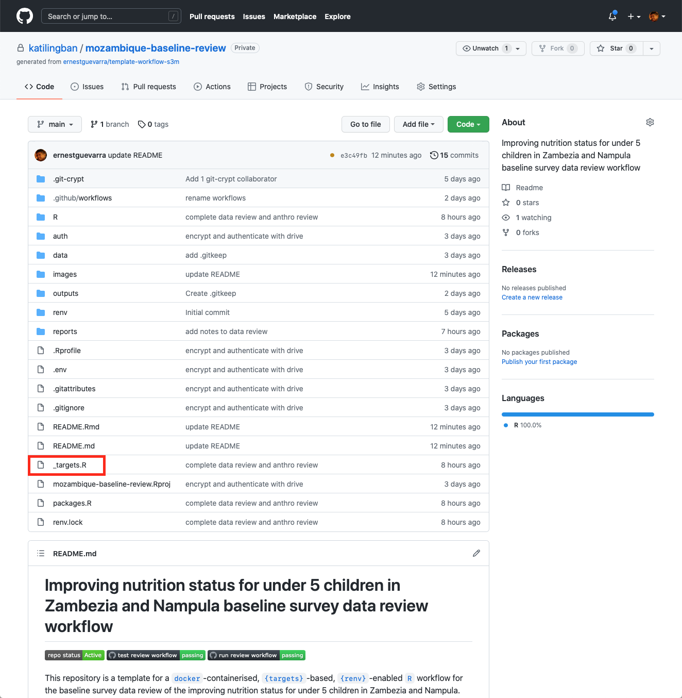
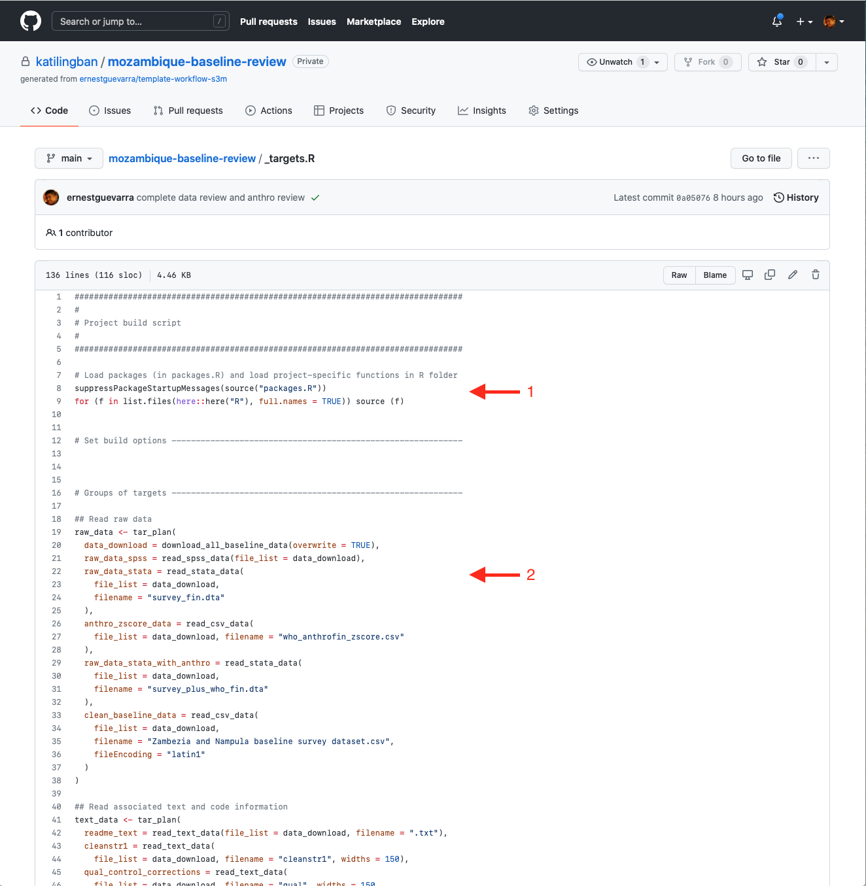

```{r setup, include=FALSE}
options(htmltools.dir.version = FALSE)
knitr::opts_chunk$set(
  fig.width=9, fig.height=3.5, fig.retina=3,
  out.width = "100%",
  cache = FALSE,
  echo = TRUE,
  message = FALSE, 
  warning = FALSE,
  hiline = TRUE
)

if (!require(remotes)) install.packages("remotes")
if (!require(fontawesome)) remotes::install_github("rstudio/fontawesome")
if (!require(tweetrmd)) remotes::install_github("gadenbuie/tweetrmd")
if (!require(webshot2)) remotes::install_github("rstudio/webshot2")
```

```{r xaringan-themer, include=FALSE, warning=FALSE}
library(xaringanthemer)
style_mono_light(
  base_color = "#002147",
  title_slide_background_image = "",
  title_slide_background_size = "cover",
  header_font_google = google_font("Fira Sans"),
  text_font_google   = google_font("Fira Sans Condensed"),
  text_font_size = "1.2em",
  link_color = "#214700",
  header_h1_font_size = "50px",
  header_h2_font_size = "40px",
  header_h3_font_size = "30px",
  code_font_google   = google_font("Fira Mono"),
  text_slide_number_font_size = "0.5em",
  footnote_font_size = "0.5em"
)
```

# Outline

* Concepts on scientific workflows

* The `{targets}` package

* Practical session

---

class: inverse, center, middle

# Concepts on scientific workflows

---

class: inverse, center, middle

# Concept #1: Reproducibility, reproducibility, reproducibility!

---

class: center, middle

```{r tweet1, echo = FALSE, eval = TRUE}
tweet_screenshot(
  tweet_url("kwbroman", "667735926915731457"),
  hide_media = TRUE,
  theme = "dark"
)
```

[Keith Baggerly](http://odin.mdacc.tmc.edu/~kabaggerly/), via [@kwbroman](https://twitter.com/kwbrowman) [tweet](https://twitter.com/kwbroman/status/667735926915731457)

---

class: inverse, center, middle

# Concept #2: Organisation

---

class:: center, middle

# File organization and naming are powerful weapons against chaos.

[@JennyBryan](https://twitter.com/jennybryan)

---

background-color: #FFFFFF
background-image: url(images/file_organisation.png)
background-size: 90%

---

class: inverse, center, middle

# Concept #3: DRY - Don't repeat yourself

---

class: center, middle

# Don't repeat yourself. It's not only repetitive, it's redundant, and people have heard it before.

Lemony Snicket

---

class: center, middle

# "You should consider writing a function whenever you’ve copied and pasted a block of code more than twice (i.e. you now have three copies of the same code)"

---

class: inverse, center, middle

# Challenges with scientific workflows

---

# Sisyphean loop

.pull-left[
 
]

.pull-right[
1. Launch the code.
2. Wait while it runs.
3. Discover an issue.
4. Restart from scratch.
]

---

# The `{targets}` package

.pull-left[

]

.pull-right[
* a pipeline toolkit for Statistics and data science in R
* maintain a reproducible workflow without repeating yourself
* learns how your workflow fits together
* skips costly runtime for tasks that are already up-to-date
* runs only the necessary computation
* supports implicit parallel computing
* abstracts files as R objects
* shows tangible evidence that the results match the underlying code and data
]

---

# `{targets}` file organisation

.pull-left[
.center[]
]

.pull-right[
* this is a typical file structure with user-defined components of any project-oriented workflow
* the `_targets.R` file, however, is special and specific to a `{targets}` workflow - it is the target script file
* the target script file should be in the project's root directory
]

---

# `{targets}` script file

.pull-left[
.center[]
]

.pull-right[
* Load the packages required (1)
* Load custom functions (1)
* Define individual targets - intermediate step of the workflow (2)
* End with a list of targets objects
]

---

background-color: #FFFFFF
background-image: url(images/workflow.png)
background-size: 60%

# `{targets}` workflow

---

class: inverse, center, middle

# Questions?

---

class: inverse, center, middle

# Practical session

## We will all continue to go through Exercise #1 in the [Practical R for Epidemiologists](https://practical-r.org/exercise1.html) book

---

class: inverse, center, middle

# Questions?

---

class: inverse, center, middle

# Thank you!

Slides can be viewed at https://oxford-ihtm.io/open-reproducible-science/session8.html

PDF version of slides can be downloaded at https://oxford-ihtm.io/open-reproducible-science/pdf/session8-reproducible-scientific-workflows.pdf

R scripts for slides available [here](https://github.com/OxfordIHTM/open-reproducible-science/blob/main/session8.Rmd)
